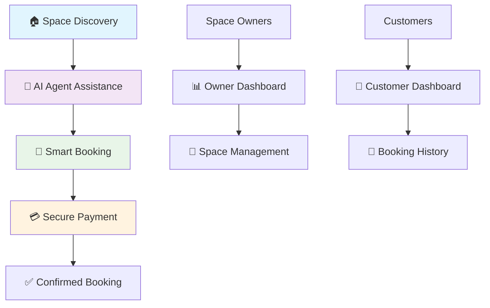
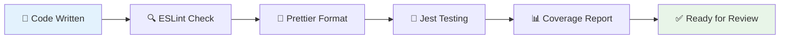
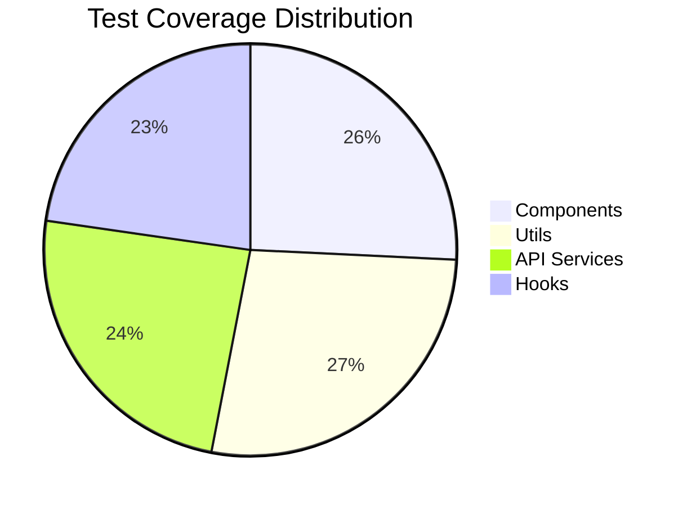
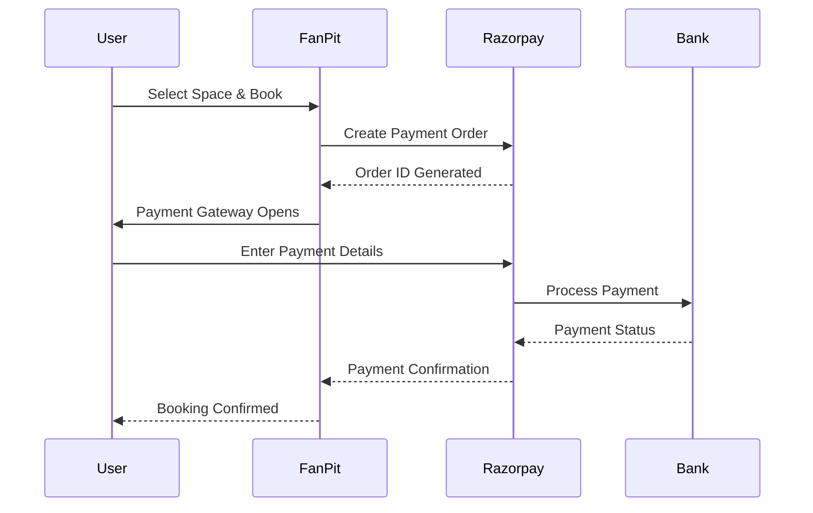
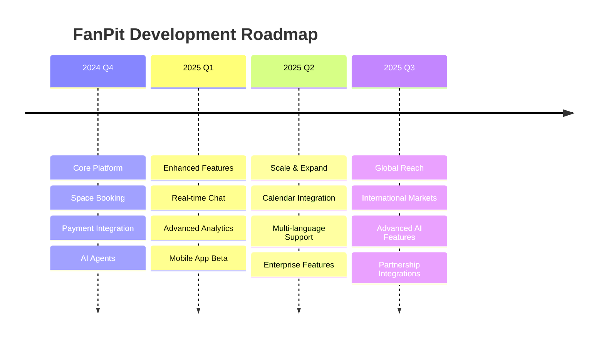

# 🏢 FanPit - AI-Powered Space Booking Platform

<div align="center">

**Backend Repository:** **[https://github.com/arjunthilak05/fanpit-backend](https://github.com/arjunthilak05/fanpit-backend)**
**Frontend Link :** **[https://fanpit-frontend-kappa.vercel.app/](https://fanpit-frontend-kappa.vercel.app/)**


**Discover • Book • Experience**

[](https://vercel.com/new/clone?repository-url=https://github.com/yourorg/fanpit-frontend)
[](fanpit-frontend-g418-git-main-arjuns-projects-8b69300d.vercel.app)


</div>

---

## 📱 Platform Screenshots

The screenshots above showcase FanPit's key features:
- **🏠 Homepage & Space Discovery** - Clean, intuitive interface for browsing available spaces
- **🤖 AI-Powered Agent Interface** - Interactive AI assistant for personalized space recommendations  
- **📅 Smart Booking System** - Streamlined booking process with real-time availability

---

## 📊 Platform Overview

FanPit revolutionizes space booking by combining intuitive design with AI-powered recommendations. Whether you're searching for conference rooms, co-working spaces, or event venues, our platform delivers personalized experiences that match your exact needs.



## ✨ Core Features

<table>
  <tr>
    <td align="center">
      
      <br><b>AI-Powered Search</b>
      <br><small>Intelligent space recommendations</small>
    </td>
    <td align="center">
      
      <br><b>Smart Booking</b>
      <br><small>Real-time availability tracking</small>
    </td>
    <td align="center">
      
      <br><b>Secure Payments</b>
      <br><small>Razorpay integration</small>
    </td>
    <td align="center">
      
      <br><b>Multi-Role Support</b>
      <br><small>Customers, owners & staff</small>
    </td>
  </tr>
</table>

### 🎯 Target Spaces
- **Conference Rooms** - Professional meeting spaces
- **Co-working Areas** - Flexible work environments  
- **Event Venues** - Memorable occasion spaces
- **Creative Studios** - Inspiration-driven locations

## 🚀 Quick Start Guide

### Prerequisites Checklist
- [ ] Node.js 18+ installed
- [ ] Backend API running on port 3001
- [ ] Razorpay account setup
- [ ] Git configured

### Installation Steps

```bash
# 1️⃣ Clone the repository
git clone https://github.com/yourorg/fanpit-frontend.git
cd fanpit-frontend

# 2️⃣ Install dependencies
npm install

# 3️⃣ Environment setup
cp .env.example .env.local

# 4️⃣ Start development server
npm run dev
```

### ⚙️ Environment Configuration

Create your `.env.local` file with these essential variables:

```env
# 🌐 API Configuration
NEXT_PUBLIC_API_URL=http://localhost:3001/api/v1

# 💳 Payment Gateway
NEXT_PUBLIC_RAZORPAY_KEY=rzp_test_RHCtm0tnz9yjuE

# 🔧 Application Settings
NEXT_PUBLIC_APP_ENV=development
NEXT_PUBLIC_FRONTEND_URL=http://localhost:3000
```

<div align="center">
  <b>🎉 Access your application at <a href="http://localhost:3000">localhost:3000</a></b>
</div>

## 📁 Architecture Overview

```
fanpit-frontend/
├── 🏗️  app/                    # Next.js App Router
│   ├── 🔐 auth/               # Authentication flows
│   ├── 🏢 spaces/             # Space discovery & booking
│   ├── 🤖 agents/             # AI agent interactions
│   ├── 📊 dashboard/          # Role-based dashboards
│   │   ├── brand-owner/       # Space management portal
│   │   ├── customer/          # User booking interface
│   │   └── staff/             # Administrative panel
│   └── layout.tsx             # Global app layout
├── 🎨 components/             # Reusable UI library
│   ├── ui/                    # Radix primitives
│   ├── layout/                # Navigation components
│   └── forms/                 # Input components
├── 🔗 hooks/                  # Custom React hooks
├── ⚡ lib/                    # Core utilities
│   ├── api/                   # Service layer
│   │   ├── client.ts          # HTTP client setup
│   │   ├── auth.ts           # Authentication service
│   │   ├── spaces.ts         # Space operations
│   │   └── payments.ts       # Payment processing
│   └── utils.ts              # Helper functions
├── 📝 types/                  # TypeScript definitions
└── 🎭 styles/                 # Global styling
```

## 🎨 Design System

### Component Library

Our design system leverages **Radix UI** primitives with **Tailwind CSS** for consistent, accessible interfaces:

<details>
<summary><b>🧩 Available Components</b></summary>

| Category | Components |
|----------|------------|
| **Navigation** | Command Menu, Dropdown, Tabs |
| **Forms** | Button, Input, Checkbox, Select |
| **Feedback** | Alert Dialog, Toast, Progress |
| **Layout** | Card, Accordion, Avatar |
| **Data** | Table, Pagination, Filters |

</details>

### Typography & Branding

```css
/* Primary Fonts */
--font-geist-sans: 'Geist Sans', system-ui
--font-geist-mono: 'Geist Mono', monospace
--font-blinker: 'Blinker', sans-serif

/* Brand Colors */
--primary: 224 71.4% 4.1%
--primary-foreground: 210 20% 98%
--secondary: 220 14.3% 95.9%
```

## 🛠️ Development Workflow

### Available Scripts

| Command | Purpose | Usage |
|---------|---------|-------|
| `npm run dev` | Development server | Local development |
| `npm run build` | Production build | Pre-deployment |
| `npm run start` | Production server | Serve built app |
| `npm run lint` | Code linting | Code quality |
| `npm run test` | Run test suite | Quality assurance |
| `npm run test:coverage` | Coverage report | Test metrics |

### Code Quality Standards



## 🧪 Testing Strategy

### Test Coverage Goals



### Running Tests

```bash
# Run all tests
npm test

# Watch mode for development
npm run test:watch

# Generate detailed coverage
npm run test:coverage

# CI-friendly test run
npm run test:ci
```

## 🤖 AI-Powered Features

### Intelligent Space Discovery

Our AI agents provide personalized recommendations based on:

- **User Preferences** - Past booking history and ratings
- **Contextual Needs** - Meeting size, amenities, location
- **Behavioral Patterns** - Usage trends and seasonal preferences
- **Real-time Factors** - Availability, pricing, reviews

```typescript
// AI Agent Integration Example
const aiRecommendations = await AgentService.getRecommendations({
  userPreferences: currentUser.preferences,
  searchCriteria: {
    capacity: 10,
    location: "Downtown",
    amenities: ["WiFi", "Projector"]
  },
  context: "team-meeting"
});
```

## 👥 User Role Management

<table>
  <tr>
    <th>👤 Customer</th>
    <th>🏢 Brand Owner</th>
    <th>👨‍💼 Staff</th>
  </tr>
  <tr>
    <td>
      • Browse & search spaces<br>
      • Make bookings<br>
      • Payment processing<br>
      • Booking history<br>
      • Profile management
    </td>
    <td>
      • Manage owned spaces<br>
      • View reservations<br>
      • Analytics dashboard<br>
      • Pricing control<br>
      • Space approvals
    </td>
    <td>
      • System administration<br>
      • User management<br>
      • Platform oversight<br>
      • Advanced analytics<br>
      • Support functions
    </td>
  </tr>
</table>

## 💳 Payment Integration

### Razorpay Configuration

```javascript
const paymentConfig = {
  key: process.env.NEXT_PUBLIC_RAZORPAY_KEY,
  amount: booking.amount * 100, // Convert to paise
  currency: 'INR',
  name: 'FanPit Spaces',
  description: `Booking: ${space.name}`,
  image: '/logo.png',
  handler: function (response) {
    // Payment success callback
    verifyPayment(response);
  }
};
```

### Payment Flow



## 🚀 Deployment Guide

### Vercel Deployment (Recommended)

1. **Connect Repository**
   ```bash
   # Install Vercel CLI
   npm i -g vercel
   
   # Deploy to Vercel
   vercel --prod
   ```

2. **Environment Variables**
   Set these in your Vercel dashboard:
   ```env
   NEXT_PUBLIC_API_URL=https://api.yourdomain.com/api/v1
   NEXT_PUBLIC_RAZORPAY_KEY=rzp_live_YOUR_LIVE_KEY
   NEXT_PUBLIC_APP_ENV=production
   NEXT_PUBLIC_FRONTEND_URL=https://yourdomain.com
   ```

### Performance Optimizations

- ⚡ **Image Optimization** - Next.js Image component with WebP support
- 🔄 **Code Splitting** - Automatic route-based bundle splitting  
- 💾 **Caching Strategy** - Aggressive caching for static assets
- 📦 **Bundle Analysis** - Regular bundle size monitoring

## 🔧 Troubleshooting

<details>
<summary><b>🐛 Common Issues & Solutions</b></summary>

### Build Errors
```bash
# Clear Next.js cache
rm -rf .next
npm run build
```

### API Connection Issues
1. Verify backend server is running on port 3001
2. Check `NEXT_PUBLIC_API_URL` environment variable
3. Review network requests in DevTools

### TypeScript Errors
```bash
# Regenerate Next.js types
npm run dev
# Manual type checking
npx tsc --noEmit
```

### Payment Integration Issues
- Verify Razorpay key configuration
- Check payment webhook endpoints
- Review transaction logs in Razorpay dashboard

</details>

## 📈 Roadmap & Future Vision

### Current Status ✅

<div align="center">


</div>

### Upcoming Features 🚧



## 🤝 Contributing

We welcome contributions from developers of all skill levels! Here's how to get started:

### Development Process

```mermaid
gitgraph
    commit id: "Fork Repository"
    branch feature
    checkout feature
    commit id: "Create Feature"
    commit id: "Add Tests"
    commit id: "Update Docs"
    checkout main
    merge feature
    commit id: "Deploy to Production"
```

### Contribution Guidelines

1. **🍴 Fork & Clone** the repository
2. **🌿 Create Feature Branch** `git checkout -b feature/amazing-feature`
3. **📦 Install Dependencies** `npm install`
4. **🔨 Implement Changes** following our coding standards
5. **🧪 Write Tests** for new functionality
6. **✅ Run Test Suite** `npm test`
7. **📝 Update Documentation** as needed
8. **🚀 Submit Pull Request** with detailed description

### Code Standards
- TypeScript strict mode enabled
- Functional components with hooks
- Comprehensive test coverage (>80%)
- Accessibility guidelines (WCAG 2.1)
- Performance best practices

## 📊 Analytics & Monitoring

Track your platform's performance with built-in analytics:

- **User Engagement** - Booking patterns and user flows
- **Space Performance** - Popular spaces and revenue metrics  
- **AI Effectiveness** - Recommendation accuracy and user satisfaction
- **Technical Metrics** - Page load times and error rates

## 🏆 Achievements & Recognition

<div align="center">

| Metric | Achievement |
|--------|-------------|
| 🎯 **User Satisfaction** | 4.8/5.0 rating |
| ⚡ **Performance Score** | 95/100 Lighthouse |
| 🔒 **Security Rating** | A+ SSL Labs |
| 🧪 **Test Coverage** | 85%+ maintained |

</div>

## 📄 License

This project is licensed under the **MIT License** - see the [LICENSE](LICENSE) file for complete details.

## 🙏 Acknowledgments

Special thanks to the amazing open-source community:

- **Next.js Team** - For the incredible React framework
- **Vercel** - For seamless hosting and deployment
- **Radix UI** - For accessible component primitives  
- **Tailwind CSS** - For utility-first styling
- **Razorpay** - For reliable payment processing

---

<div align="center">

**Built with ❤️ by the FanPit Team**

[](https://fanpit.vercel.app)
[](mailto:support@fanpit.com)
[](https://github.com/yourorg/fanpit-frontend)

</div>
# Force rebuild
